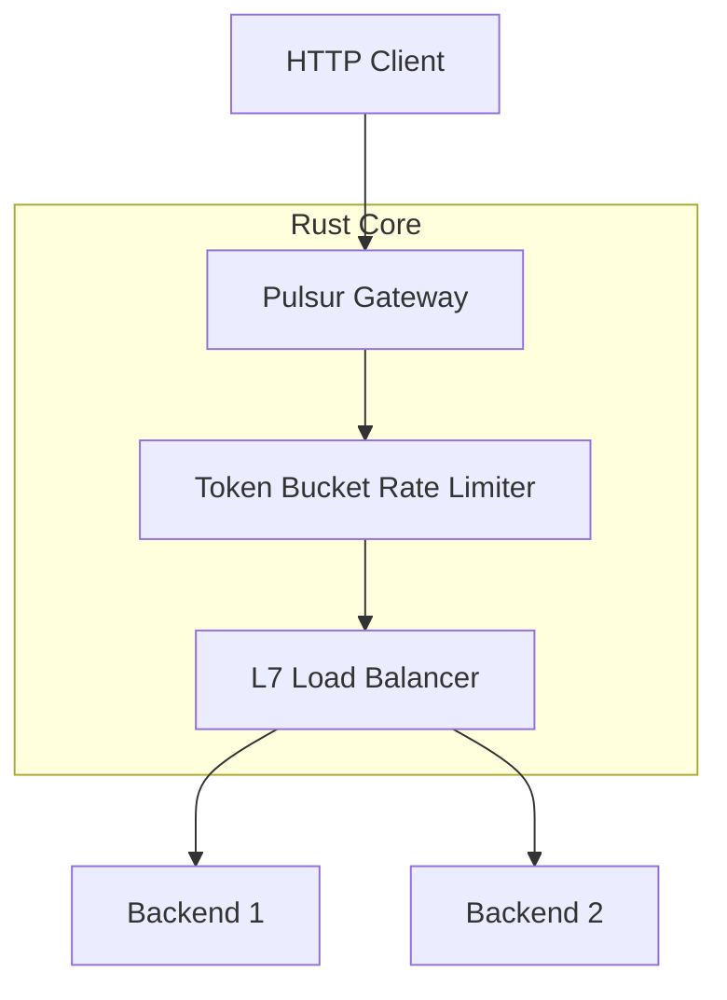

# Pulsur 🦀

**Ultra-high performance, Rust-native distributed engine for modern infrastructure.**

[](LICENSE)
[](results/FINAL-REPORT.md)
[](results/FINAL-REPORT.md)

Pulsur is a next-generation distributed engine that replaces heavy Node.js infrastructure with high-efficiency Rust components. It integrates **Layer 7 Load Balancing**, **Distributed Rate Limiting**, and a **Native HTTP Stack** into a single zero-dependency binary.

---

## 🚀 The Performance Leap
In a head-to-head comparison against a standard Node.js/Express infrastructure stack, Pulsur delivered:

- **+34% Higher Throughput**: Sustaining ~24,900 requests per second.
- **-93% Memory Reduction**: Running at just **3.1MB RAM** compared to 45MB in Node.js.
- **Superior Tail Latency**: Optimized p99 latency of **15ms**, beating Node's 17ms.

| Metric | Node.js (Baseline) | Pulsur (Optimized) |
| :--- | :--- | :--- |
| **Peak Requests/sec** | ~18,500 | **~24,900** |
| **Average Latency** | 4.91 ms | **3.52 ms** |
| **p99 (Tail) Latency** | 17 ms | **15 ms** |
| **Idle Memory (RSS)** | 32 MB | **2.8 MB** |

---

## 🏗️ Architecture
Pulsur is a modular "Engine of Crates" orchestrated by the Tokio async runtime.



---

## 📦 Core Component Modules
The engine is split into independent, battle-tested Rust crates:

- **`http-server`**: Low-level TCP management, TLS termination, and WebSocket engine.
- **`gateway`**: High-level orchestration, plugin system, and Request/Response lifecycle.
- **`load-balancer`**: Advanced routing (Round Robin, Weighted, Sticky Sessions).
- **`rate-limiter`**: Lock-free concurrent Token Bucket implementation.
- **`circuit-breaker`**: Fault-tolerance and cascading failure prevention.
- **`observability`**: Structured tracing (JSON) and health-check monitoring.

---

## 🛠️ Quick Start

### Build from Source
```bash
# Build the optimized release binary
cargo build --release

# Run the full-stack benchmark server
./target/release/full_stack_bench
```

### Node.js Bridge
Pulsur provides a zero-latency bridge for JavaScript developers using NAPI-RS.
```javascript
const { PulsurServer } = require('@pulsur/http-server');

const server = new PulsurServer({ port: 8080 });
server.get('/', (req, res) => res.send("Powered by Rust"));
server.listen();
```

---

## 📁 Repository Map
- `/crates`: The Rust workspace (Core Logic).
- `/packages`: The Node.js SDK and Dashboard.
- `/results`: Raw benchmark data and the [Final Report](results/FINAL-REPORT.md).

---

## 📑 Detailed Reports
- [Final Performance Analysis](results/FINAL-REPORT.md)
- [Codebase Architectural Review](REPORT.txt)
- [Technical Blog Post: Node.js to Rust journey](BLOG_POST.md)

---
Distributed under the MIT License. Built for the high-performance web.
