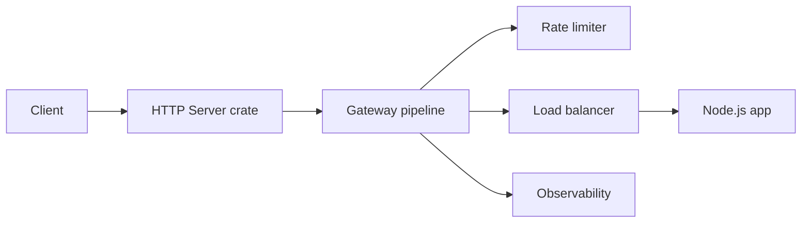
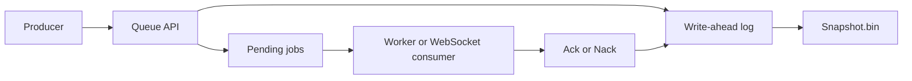
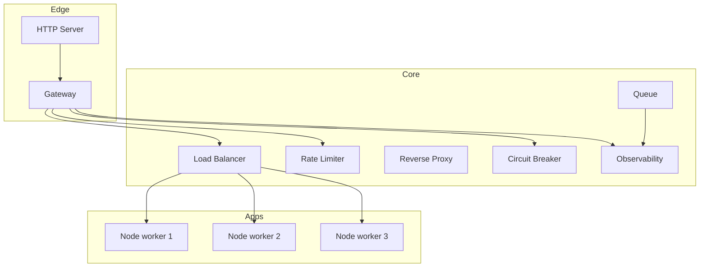

# Architecture Overview

Pulsur is structured as a Rust workspace with a thin Node-facing bridge. The current repository favors one shared versioned workspace, repo-local examples, and JS integration points that remain usable even when a native binding is unavailable.

## Request flow

## Queue and worker flow

## Deployment topology

## Design themes in the current codebase

- shared versioning through the Rust workspace
- explicit packaging for npm-distributed binaries
- JS fallbacks that keep local development moving
- persistence via append-only WAL plus snapshot compaction in the queue
- plugin-style request processing in the gateway

## What is production-ready vs early-stage

More mature in repo terms:

- HTTP parser and server core
- gateway pipeline and config parsing
- queue persistence model
- rate limiter algorithms
- release and npm packaging flow

Still evolving:

- breadth of published npm packages beyond the HTTP server launcher
- dashboard and broader docs polish
- some cross-platform native packaging paths that depend on CI runners
