# Performance Benchmarks

Pulsur aims to be the fastest infrastructure layer for Node.js. We don't just claim performance; we measure it using industry-standard tools and reproducible methodologies.

## Summary

In current baseline tests, Pulsur shows a significant improvement in throughput and a reduced resource footprint compared to standard Node.js server configurations.

```mermaid
gantt
    title Requests Per Second (Throughput)
    dateFormat  X
    axisFormat  %s
    
    section Node.js
    6,157 requests/sec : 0, 6157
    
    section Pulsur
    8,114 requests/sec : 0, 8114
```

## Methodology

To ensure fairness and prevent "benchmark shopping," we use a strict testing environment:

- **Machine Name:** Windows Workstation
- **OS:** Windows 11 Enterprise
- **Node.js:** v22.19.0
- **Rust:** 1.94.1
- **Tooling:** `autocannon` (100 concurrent connections, 10s duration)
- **Baseline:** Standard Node.js `http.createServer` instance.

## Comparison Results

The following table shows the delta between Node.js and Pulsur on a standard "Hello World" style request.

| Metric | Node.js Baseline | Pulsur HTTP Server | Delta |
| :--- | :--- | :--- | :--- |
| **Avg Req/Sec** | 6,157.4 | 8,114.9 | **+31.8%** |
| **p50 Latency** | 12 ms | 9 ms | **-25.0%** |
| **p99 Latency** | 82 ms | 63 ms | **-23.2%** |
| **Memory (RSS)** | 28.50 MB | 7.49 MB | **-73.7%** |
| **Startup Time** | 1982.15 ms | 1842.28 ms | **-7.1%** |

## Microbenchmarks

Internal operations measured with `cargo test`:

| Operation | Performance |
| :--- | :--- |
| `router.match_route` | 119,051 ops/sec |
| `parse_request` | 28,338 ops/sec |
| `send_response` | 14,687 ops/sec |

## Reproduce It Yourself

We believe in open data. You can run these benchmarks on your own machine:

1. Clone the repository
2. Build the project: `cargo build --release`
3. Run the baseline: `node benchmarks/node_http.js`
4. Run the Pulsur benchmark: `./target/release/examples/benchmark`
5. Compare results using `npx autocannon -c 100 -d 10 http://localhost:PORT`

## Honest Caveats

While these numbers look great, it's important to understand what they *don't* measure:

1. **Complex Logic:** Benchmarks currently use simple "Hello World" responses. Real-world middleware chains and DB calls will narrow the performance gap.
2. **Network I/O:** These tests were run on `localhost`. Real network latency will often be the bottleneck.
3. **Maturity:** Node.js is battle-tested over 15 years. Pulsur is newer and might have edge cases that Node.js handles gracefully.

If you find a use case where Pulsur performs poorly, please [open an issue](https://github.com/pulsur/pulsur/issues).
